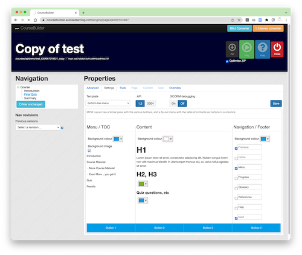
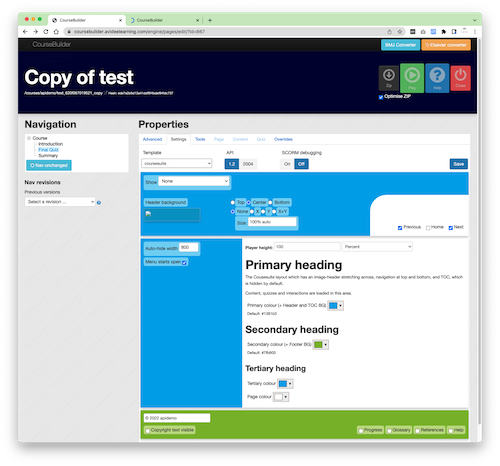
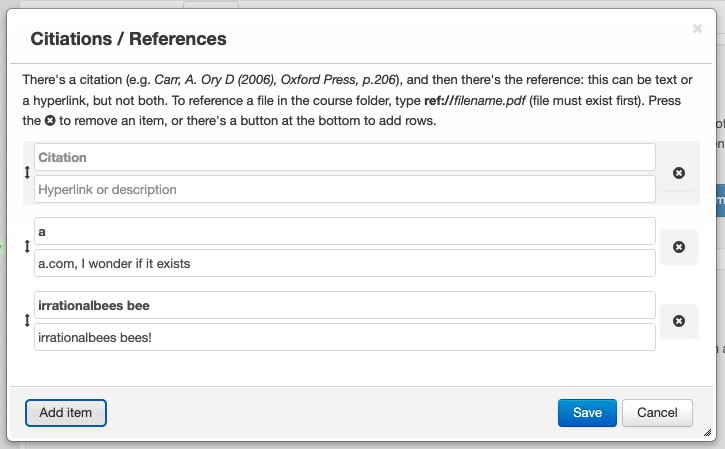
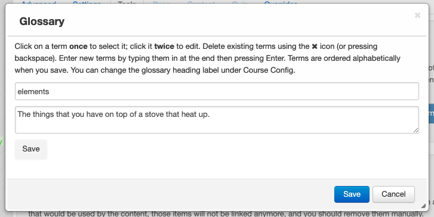
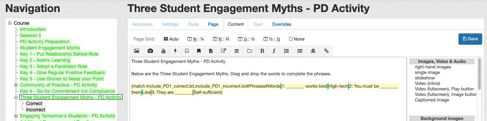
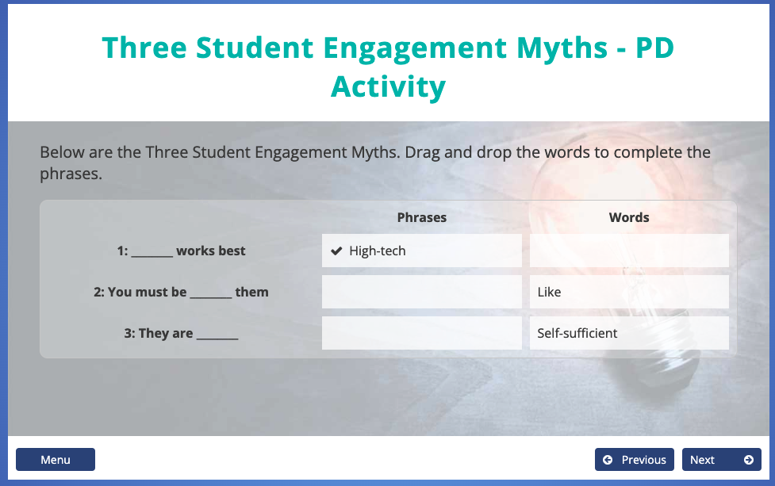

# CourseBuilder

This is a dump of the code for running CourseBuilder, a course production environment for deploying SCORM courses. It is best used for text-heavy courses with complex user interactions, rather than image-heavy slide-based courses.

## The good:

- Templatable courses
- Nestable menus (multi-level)
- Smart text-based editor with support for custom widget markup language called Ninjitsu
- Extensible widget library
- Support for glossaries, embedded and downloadable resources, custom script, custom templates, custom runtime engines
- Templatable and fully customisable player designs
- Runtime or deploy-time server side rendering for rapid prototyping of content
- Quiz engine supporting a variety of question type
- Folder-based approach to editing
- Custom importers for various specific course formats
- Multi-tenancy with built-in or API-based authentication
- Simple-to-understand page layout (left and right column with automatic heading, media placement and biases based on device and orientation)

## The bad:

Ninjitsu is a text-token based nestable rendering language and is in no way WISYWIG compatible. It was introduced at a time when browser rendering engines different in vast, unproductive ways (IE6+, Safari IOS 9+, Chrome, etc) and the ability to adjust rendering techniques at runtime to product consistent formatting between devices was required.

The Ninjitsu editor requires matched tokens with arrays of values, for instance

`{bullets Point One|Point two|Point three}` to produce a bulleted list, or `{rightimages box-shadow rp-bouncein|AdobeStock_134779826_edited.png}` to produce an image with box shadow, dynamically sized based on the colum layout of the page, that animates from the top of the page and bounces. 

## The ugly

This app was written in a combination of JScript, VBscript, PHP, XCopy, Batch files, and executables. It does not require ASP.NET.

It extensively uses that remarkable hack inside Classic ASP where memory is shared between vbscript, jscript and php so functions can call each other during page execution. It can be quite hard to follow.

This web site was designed to be run on Windows Server 2003 or 2012. It won't run on Azure. It requires Classic ASP with jscript, vbscript AND php7 (cgi) installed. It requires 32-bit COM, Helicon ISPI Rewrite 3, CXImageATL.dll, XZip.dll,  MySql Server with ODBC 5.1 driver. The web user requires server execute permission for various functions (like compiling LESS or resizing images). It requires an integrated pipeline with no managed code, 32-bit access and sessions and applications enabled.

## The really ugly

Those functions that run in VBScript to read and write JSON files (using a ES3-compatible JSON parser) and then have to deal with the byte-order-mark that windows insists on putting on UTF8 encoded files

The hand-crafted version of HandlebarsJS and JQuery that can run server-side on ES3 (!) with a bunch of prototype hacks to support arrays, etc.

The need to build a menu and save it and then set its node properties and save that before you can edit the content that would then be attached to those nodes in the XML-based menu.

Dealing with XML in vbscript, jscript AND php on windows, and the Byte-order-mark to boot. That's the really really ugly. 

## Screenshots

Menus can have a number of designs (templatable, editable) each with a set of configrable options

Citations and references can be added (with some smart linking built in, for instance you can link to PubMed articles automatically).

Glossary editor

Editor uses a text-based system with automatic rendering at runtime. The header and drag and drop functionality are automatically calculated from the markup.

## Development

HA! Hasn't had an update in years. 

## Licence

WTFPL. No warranty.